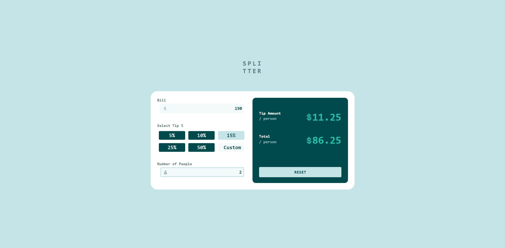
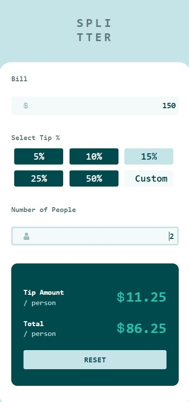

# Frontend Mentor - Tip calculator app solution

This is a solution to the [Tip calculator app challenge on Frontend Mentor](https://www.frontendmentor.io/challenges/tip-calculator-app-ugJNGbJUX). Frontend Mentor challenges help you improve your coding skills by building realistic projects.

## Table of contents

- [Overview](#overview)
  - [The challenge](#the-challenge)
  - [Screenshot](#screenshot)
  - [Links](#links)
- [My process](#my-process)
  - [Built with](#built-with)
  - [What I learned](#what-i-learned)
  - [Continued development](#continued-development)
  - [Useful resources](#useful-resources)
- [Author](#author)

## Overview

### The challenge

Users should be able to:

- View the optimal layout for the app depending on their device's screen size
- See hover states for all interactive elements on the page
- Calculate the correct tip and total cost of the bill per person

### Screenshot





### Links

- Solution URL: [https://www.frontendmentor.io/solutions/tip-calculator-app-using-reactjs-_R5acdgENF](https://www.frontendmentor.io/solutions/tip-calculator-app-using-reactjs-_R5acdgENF)
- Live Site URL: [Add live site URL here](https://sensational-bombolone-377907.netlify.app)

## My process

### Built with

- [React](https://reactjs.org/) - JS library
- Semantic HTML5 markup
- CSS custom properties
- Flexbox
- CSS Grid

### What I learned

```js
useEffect(() => {}
```

```js
tip = tip.toFixed(2);
total = total.toFixed(2);
```

```js
const [Bill, setBill] = useState("");

onChange={(e) => setBill(e.target.value)}
```

### Continued development

- Mobile-first workflow

### Useful resources

- [React ](https://reactjs.org/docs/hooks-effect.html) - This helped me for using useEffect hook.

## Author

- Website - [Krishnanand A](https://krishnanand-a.web.app)
- Frontend Mentor - [@krishnanand654](https://www.frontendmentor.io/profile/krishnanand654)
